# lv_port_esp32_squareline_studio
LVGL (Light and Versatile Embedded Graphics Library ) example project for Espressif IDF (IoT Development Framework) version 5.2. That can be used in combination with SquareLine Studio (GUI based user interface design program) for generating firmware for ESP32 based boards.  

Big thanks to Hiruna, I forked his project and implemented minor changes to make it work with the Sunton ESP32-2432S028 board

## How to use with Sunton esp32_2432S028 board?
### Step 1:
Clone this repo:  
`git clone --recurse-submodules https://github.com/littleboot/lv_port_esp32_squareline_studio.git`  

Copy the `boards\sunton_esp32_2432S028` board folder to the SquareLine Studio boards folder, the SquareLine Studio docs stated that this location can be found inside the installation directory however on my windows system this folder was located inside documents folder: `C:\Users\admin\Documents\SquareLine\boards\Espressif`.

### Step 2:
Open SquareLine Studio and create a new project for the Sunton ESP32-2432S028 board. Choose a project name and location for the project.  
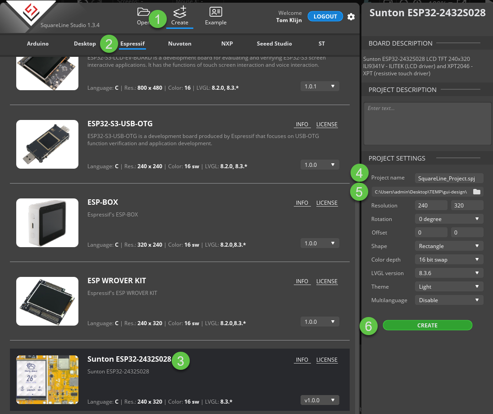

### Step 3:
Configure the "Project export root" path to a folder were you would like to have the IDF project.  
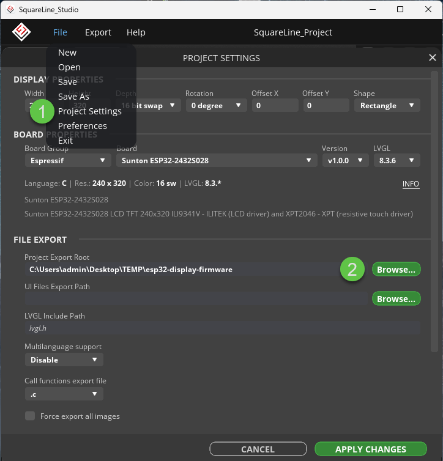  

### Step 4:
Design a GUI (you can also do this later, a empty gui is sufficient) and export the idf project template and UI files.  
*NOTE: after every UI Files export you need to run the fix script to fix the CMakeLists.txt file*  
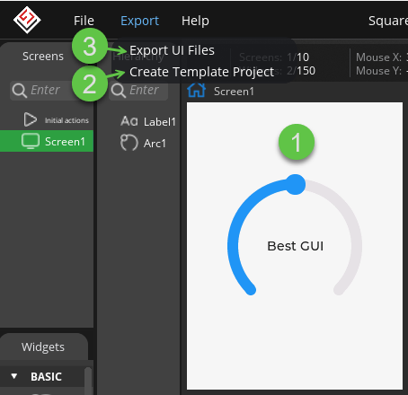  

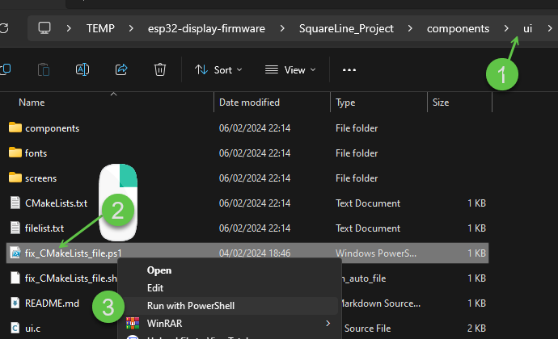  

Tip:
You can also add a task to the VScode project folder that runs the script:
Add this task to the `tasks.json` file located in the `.vscode` folder inside the project directory.
```json
{
  "label": "Squareline UI export fix CMakeLists file",
  "type": "shell",
  "command": "powershell",
  "args": [
    "-NoProfile",
    "-Command",
    "cd \"${workspaceFolder}/components/ui\" ; ./fix_CMakeLists_file.ps1"
  ],
  "problemMatcher": []
},
```
To run the task press F1:  
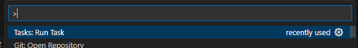  
click on the task:  
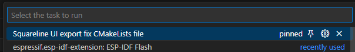  

### Step 5 (IDE specific)  
You should now be able to compile the project with IDF V5.2.  
I prefer using VScode in combination with the ESP-IDF extension. However the project can be used with other IDE's as wel.  
To be able to compile and flash the device from within vscode using the ESP_IDF extension it needs to know where it can find the idf build tools. These settings are stored in the project root `.vscode` folder.
To generate this folder:  

1. open vscode, Install and configure the ESP-IDF extension
2. Create new idf project (press f1, and run cmd: `ESP-IDF: New Project`)
3. Configure this project and when finished copy the `.vscode` folder to the folder were the board template project was exported by SquareLine Studio.
4. Open the SquareLine Studio exported template folder in vscode (as root directory).
5. Build and flash the project to test if it is working.  

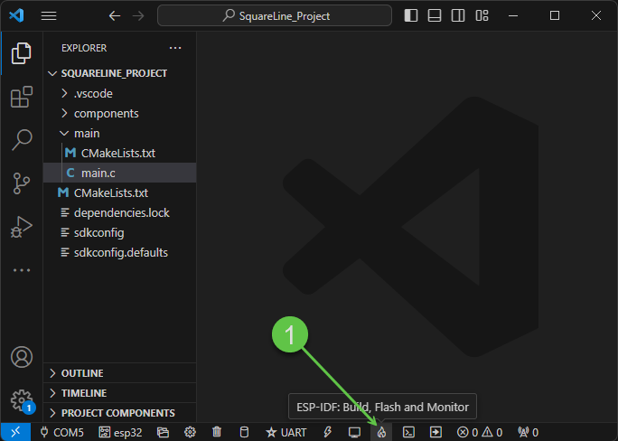  
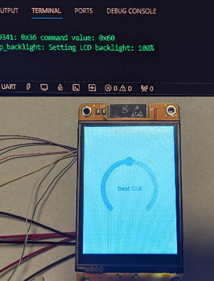

### Using the example UI from the example folder
A very simple UI was created in SquareLine Studio (V1.3.4) to validate the hardware:  
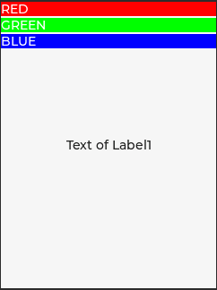

To use this UI copy the exported UI files from `\examples\sunton_esp32_2432S028\simple_ui_export\ui` to the idf project folder `__ui_project_name__\components\ui`  

or export them yourself using SquareLine Studio, the project files are located here: `\examples\sunton_esp32_2432S028\simple_ui_squareline_project`  

*NOTE: You will have to change the `Project Export Root` `UI Files Export Path` inside the project settings*

## How I got LVGL working on the Sunton ESP32-2432S028
### Intro
Like a lot of my projects this one started with a purchase on AliExpress.
I was looking for a cheap development board with a display that I could use to read and show sensor values for a proof of concept design I'm working on.

That's when I found the following board:  
Sunton ESP32-2432S028 (€14,16 inc shipping Order date: Dec 14, 2023) [AliExpress link](https://vi.aliexpress.com/item/1005005616073472.html)

It seemed like a perfect fit and I taught I should have it working quickly. However this turned out to be a bit of a challenge.  

### Challenges / problems I encountered
1. The official LVGL example port for the ESP32 ([lv_port_esp32](https://github.com/lvgl/lv_port_esp32)) couldn't be compiled with the latest stable  version of IDF 5.2 as of writing (06/02/2024)
2. Backlight / brightness setting not working
3. LVGL demo was displayed incorrectly: wrong orientation, inverted and incorrect colors
4. Compiling project with UI export from SquareLine Studio

### 1. Fixing IDF version 5.2 compile problem
After trying to fix the lv_port myself, I found a working project of someone that recently created a lvgl port for the sunton_esp32_2432S028 that could be compiled with IDF 5.2: https://github.com/limpens/esp32-2432S028
This worked but I actually wanted a working project based on the official port because I'm planning to use a different display and controller for future projects. After looking at the official repo again I finally noticed the pull request and found the https://github.com/hiruna/lv_port_esp32/tree/develop/lvgl_8.3.7_idf_5.2 repo!  
Thank you hiruna! He fixed the official port, he even made a pull request. I have no clue why it is still not merged with the official repo. Noticing this sooner could have saved me a lot of time.

### 2. Fixing backlight / brightness setting not working
After configuring the project menuconfig (idf sdk config) so the correct GPIO's were assigned to the driver. (The pinout can be found here: https://macsbug.wordpress.com/2022/08/17/esp32-2432s028/)

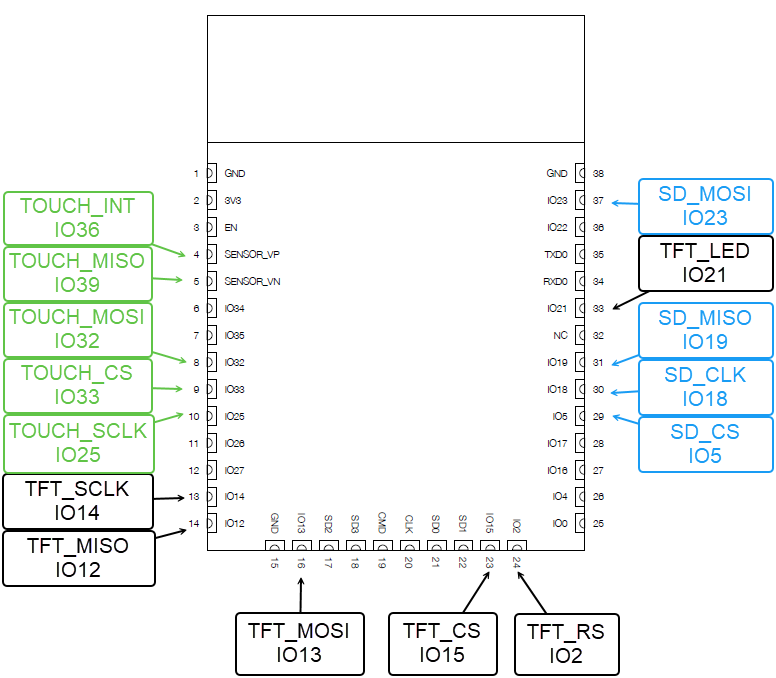

| LCD Signal | ESP32-2432S028 |
| ---------- | -------------- |
| RESET      | \-             |
| SCL (CLK)  | GPIO14         |
| D/C (RS)   | GPIO2          |
| CS         | GPIO15         |
| SDA (MISO) | GPIO12         |
| SDO (MOSI) | GPIO13         |
| Backlight  | GPIO21         |


I noticed that the backlight (and changing the brightness level) was not working. As a quick workaround I changed the backlight control method from PWM to SWITCH control in the sdk config: `CONFIG_LV_DISP_BACKLIGHT_SWITCH=y`.  

TODO, implement proper fix for this bug.
See: https://github.com/lvgl/lvgl_esp32_drivers/issues/222 (zuckschwerdt reply)

### 3. Fixing display image inversion and colors
When I first uploaded one of the demo UI's to the board, the display was inverted and the colors were incorrect (orange color instead of blue):  
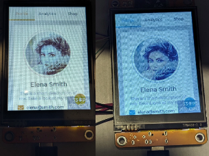

This problem was caused by an incorrect data buffer definition in the `ili9341_set_orientation` function:  
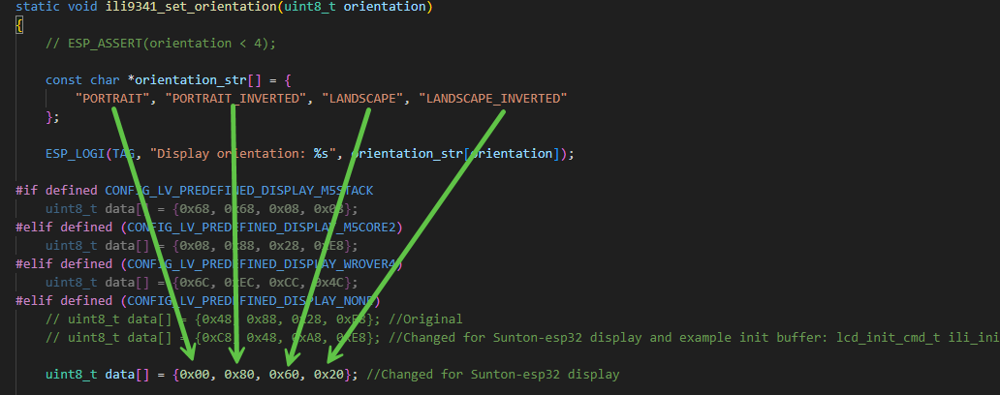

This buffer describes the initialization state of the Memory Access Control register of the display driver. For more information see datasheet ili9341 driver page 129 "8.2.29. Memory Access Control (36h)".

For the Sunton ESP32-2432S028 board it should be defined as:
```c
uint8_t data[] = {0x60, 0x20, 0x00, 0x80};
```

The correct definition can differ between boards, this can be found by trial and error. The code below can be added to overwrite the data buffer to try out different bit values:  
```c
	//Memory Access Control register (36h)
	uint8_t MAC_reg = 0x00; 

	//Register Bit values
	//These 3 bits control MCU to memory write/read direction.
	uint8_t MY_RowAddressOrder = 0; //D7
	uint8_t MX_ColumnAddressOrder = 1; //D6
	uint8_t MV_RowColumnExchange = 1; //D5
	//LCD vertical refresh direction control.
	uint8_t ML_VerticalRefreshOrder = 0; //D4
	//Color selector switch control (0=RGB color filter panel, 1=BGR color filter panel)
	uint8_t BGR_RGBBGROrder = 0; //D3
	//LCD horizontal refreshing direction control.
	uint8_t MH_HorizontalRefreshOrder = 0; //D2
	//D1 = Don't care
	//D0 = Don't care

	MAC_reg |= (MY_RowAddressOrder << 7);
	MAC_reg |= (MX_ColumnAddressOrder << 6);
	MAC_reg |= (MV_RowColumnExchange << 5);
	MAC_reg |= (ML_VerticalRefreshOrder << 4);
	MAC_reg |= (BGR_RGBBGROrder << 3);
	MAC_reg |= (MH_HorizontalRefreshOrder << 2);

	ESP_LOGI(TAG, "MAC_reg value: 0x%02X", MAC_reg);

	data[orientation] = MAC_reg;
```

### 4. Getting lv_port_esp32 working with custom UI from SquareLine Studio
After every export of the UI files from SquareLine Studio the CMakeLists.txt file needs to be fixed:  
- `.\__ui_project_name__\components\ui\fix_CMakeLists_file.ps1` for windows
- `.\__ui_project_name__\components\ui\fix_CMakeLists_file.ps1` for linux

This will replace the `add_library` function in the `CMakeLists.txt` with the idf specific version `idf_component_register`.

Additionally the `ui_events.c` wasn't generated by SquareLine Studio making the compilation fail. To fix this an empty c file with this name was added to the UI folder.

## Sunton board added to esp32 drivers as predefined display
The esp32 driver repo was forked and updated to include the Sunton ESP32-2432S028 for automatic configuration (by modifying the kconfig and ili9341 driver files).

# Original (unmodified) project readme below
## Overview
This repository can be used to generate SquareLine Studio boards for ESP32 devices
(connected to supported display drivers defined in [lvgl_esp32_drivers](https://github.com/hiruna/lvgl_esp32_drivers/tree/develop/lvgl_8.3.7_idf_5.2)).

Project structure in _[\__ui_project_name\__](./__ui_project_name__)_ follows a similar structure to
[lv_port_esp32](https://github.com/hiruna/lv_port_esp32/tree/develop/lvgl_8.3.7_idf_5.2).
### Tested Library Versions
* ESP-IDF
  * v5.2 [master](https://github.com/espressif/esp-idf/tree/master/)
* `lvgl_esp32_drivers`
  * https://github.com/hiruna/lvgl_esp32_drivers/tree/develop/lvgl_8.3.7_idf_5.2
* LVGL
  * [release/v8.3](https://github.com/lvgl/lvgl/tree/release/v8.3)

### Boards
| Board Name                                            | Driver  | Image                                                           | Example                                                                                                                               |
|-------------------------------------------------------|---------|-----------------------------------------------------------------|---------------------------------------------------------------------------------------------------------------------------------------|
| [esp32_ssd1306_128x64](./boards/esp32_ssd1306_128x64) | SSD1306 |  |  <br/> [Source Files](./examples/esp32_ssd1306_128x64) |


## Create a new board
Refer to https://docs.squareline.io/docs/obp.

1. Clone this repo
2. Create a new directory under [boards/](./boards)
   *  Example: `your_board_name/`
4. Add the `your_board_name.png` file
   * A photo of the board to be displayed in SquareLine Studio.
6. Add the `your_board_name.slb`
   * SquareLine board definition file (see https://docs.squareline.io/docs/obp#your_boardslb for more information)
     * For monochrome displays such as the SSD1306 OLED panel, keep the `color_depth` at `8`, SquareLine currently
       does not support depth < 8. You will need to fix this, [see below](#monochrome-display-lv_color_depth-assertion-error).
     * Set the `lvgl_export_path` to `false` as the submodule reference _[\__ui_project_name\__/components/lvgl](./__ui_project_name__)_ is used
     * Set the `pattern_match_files` to `CMakeLists.txt,main/main.c` as this will replace templated tags such as `__UI_PROJECT_NAME__`
     * Set the `ui_export_path` to `./components/ui`
     * Set the `supported_lvgl_version` to `8.3.*`
7. Copy `your_board_name/` directory to the SquareLine installation's `boards/Espressif` directory
8. Create a compressed ZIP file of the _[\__ui_project_name\__](./__ui_project_name__)_ directory
   * This is common to all supported display drivers in [lvgl_esp32_drivers](https://github.com/hiruna/lvgl_esp32_drivers/tree/develop/lvgl_8.3.7_idf_5.2)
9. Rename the ZIP file to `your_board_name.zip`
10. Copy the `your_board_name.zip` to SquareLine installation's `boards/Espressif/your_board_name` directory

## Create a new SquareLine Studio Project
1. Once you have created a new board (or used one of the existing boards in this repo), open SquareLine Studio.
2. The board you've created will appear in SquareLine Studio.
   * _Example of the [ESP32 SSD1306 128x64 OLED](./boards/esp32_ssd1306_128x64) "board"_ is shown below.

       
3. Set your project settings and create the project
   * 
4. Once the new project is created and loaded, export the template project via <b>Export -> Create Template Project</b>
   * 
   * You can export the template project anywhere. In this example, I have created an `export` directory inside the SquareLine project's
     directory
     * 
   * Once exported, verify that the template project files are exported in the path you specified
     * 
5. Open the exported template project directory via your IDE. I am using CLion to open it.
### CMake error `add_library command is not scriptable`
6. Once the project is opened via the IDE, CMake will throw the following error:
    * 
      * This error is in the exported `ui` directory's CMakeLists.txt file
        * 
      * Replace the `add_library(ui ${SOURCES})` line with the following:
        * ```cmake
          idf_component_register(SRCS ${SOURCES}
                  REQUIRES lvgl)
          ```
          *  
          * <b>NOTE:</b> You will need to modify this every time you export the UI files.
      * Reset CMake cache and reload CMake project
7. Run `idf.py menuconfig` to configure the display drivers and LVGL 
8. Build the ESP-IDF project
8. Flash the ESP32 board

### Monochrome display `LV_COLOR_DEPTH` assertion error
As previously mentioned, SquareLine Studio currently does not support color depth < 8. Assuming that you've set the 
LVGL color depth to `1` via the project's `menuconfig`, build attempts will result in the following error:
* 
  * This error is the result of an automatically added assertion/config check, in the generated UI files. It checks if
    the set `LV_COLOR_DEPTH` (i.e set via `menuconfig`) matches the `color_depth` set in the board's `.slb` file.
    * 
  * To fix this error, simply replace the expected color depth (i.e. `8`) to `1`
    * 
    * <b>NOTE:</b> You will need to modify this every time you export the UI files.
  * Building the project after fixing this error will succeed
    * 

### Monochrome display `lv_theme_*_init` error
Assuming that you've only enabled the "Monochrome theme" for your monochrome display (as you should via the project configuration 
i.e.`menuconfig`)
* Example
  * 
build attempts will result in a similar error to the one shown below:
  
  * The error is in the exported `ui.c` file
    * 

This happens because SquareLine Studio currently does not include an option to select the monochrome theme.

To fix this issue, simply change the theme initialization code as follows:

* <b>NOTE:</b> You will need to modify this every time you export the UI files.
